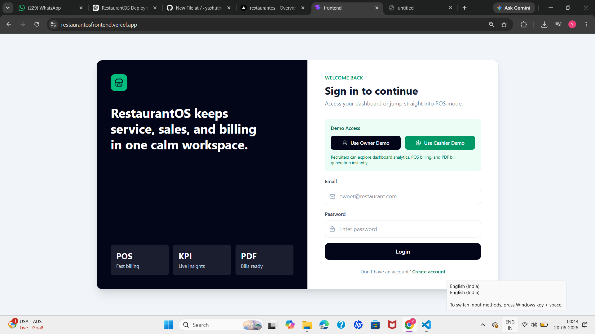
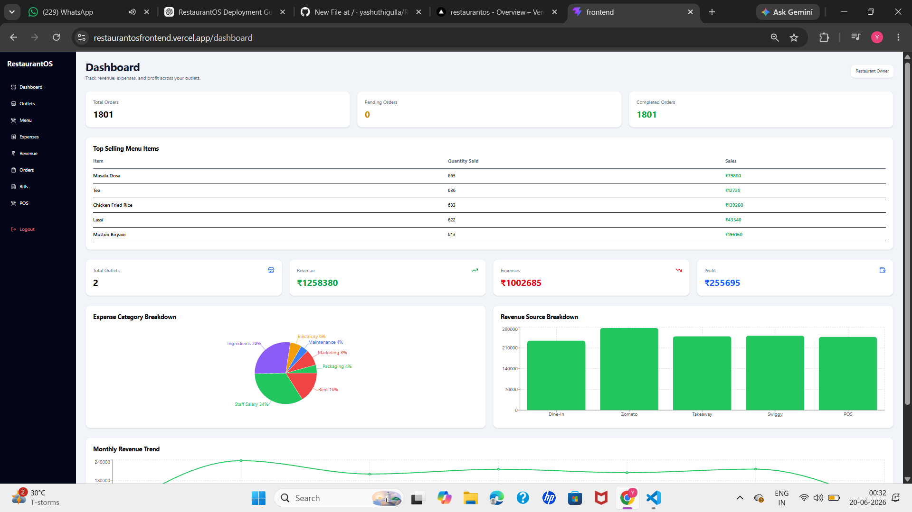
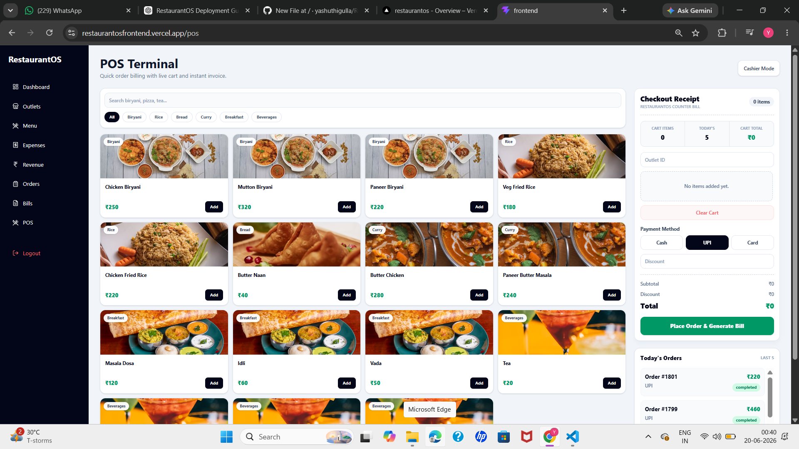
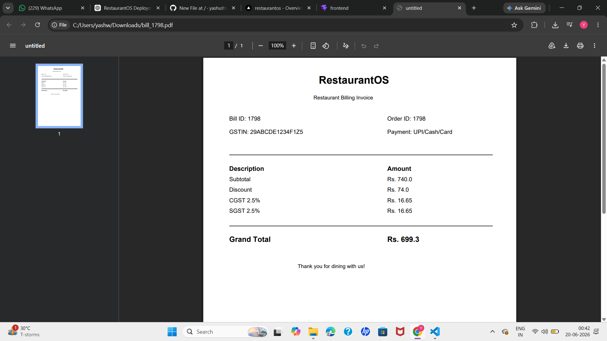

#  RestaurantOS

A full-stack Restaurant Management & POS Platform built using React, FastAPI, and MySQL.

##  Features

### Authentication

* JWT Authentication
* Owner & Cashier Roles
* Secure Login & Registration

### Dashboard

* Revenue Analytics
* Expense Analytics
* Profit Tracking
* KPI Cards

### POS System

* Fast Billing
* Cart Management
* Order Processing
* Multiple Payment Methods

### Management

* Menu Management
* Outlet Management
* Revenue Tracking
* Expense Tracking

### Billing

* PDF Bill Generation
* Order History
* Sales Tracking

---

##  Tech Stack

### Frontend

* React
* TypeScript
* Tailwind CSS
* Axios
* Recharts

### Backend

* FastAPI
* SQLAlchemy
* JWT Authentication

### Database

* MySQL

### Deployment

* Vercel
* Render

---

##  Live Demo

Frontend:
https://restaurantosfrontend.vercel.app

---

##  Demo Credentials

### Owner Account

Email: [yash@gmail.com](mailto:yash@gmail.com)

Password: 123456

### Cashier Account

Email: [cashier@gmail.com](mailto:cashier@gmail.com)

Password: 123456

---

##  Screenshots

### Login Page

### Dashboard

### POS Billing

### PDF Invoice

---

##  Author

Yashwanth Goud

Software Engineer Trainee

Frontend & Full Stack Developer
